# Lumen Logic — Functioneel ontwerp (compleet)

> **Status:** opgesteld 2026-07-07, in opdracht van Timo: "alle features uit alle bronnen,
> de hele appstructuur alsof je mappen schuift, per scherm hoe de knopjes staan, met
> flow-diagrammen van hoe alles werkt."
>
> **Verhouding tot de andere docs:** `docs/MASTERPLAN.md` = de koers en het waarom
> (besluitenlog grill-sessie). Dít document = het wat en hoe, uitputtend. Bij conflict
> wint het masterplan-besluit; dit document werkt het uit.
>
> **Bronnen** (elke feature is getraceerd):
> - **[B]** `docs/lumenlogic-briefing.md` — platformbriefing Brink, 2026-06-23
> - **[P]** `docs/lumenlogic-podcast-transcript.md` — audio-versie briefing (rijker in details)
> - **[R]** `docs/matching-regelset.md` — vijfstatussen-regelset, met Eduard vastgesteld
> - **[G]** grill-sessie 2026-07-07 — besluitenlog in `docs/MASTERPLAN.md` §2
> - **[E]** Estimate Builder v2/v3-docs (`~/brink-estimate-builder-v3/docs/`) — beslissingen
>   die meeverhuizen nu Lumen Logic de estimate-functie absorbeert
> - **[X]** bestaande app (runs 1–3) — wat er al staat
> - **[L]** mail Lynx Solutions 2026-06-24 + `docs/xis-post-api-attributes.md`
>
> **Weergavetip:** de flow-diagrammen zijn Mermaid — GitHub en VS Code (met
> Markdown-preview) renderen ze als echte diagrammen. De wireframes zijn tekstueel
> zodat elke bouwsessie ze 1-op-1 kan lezen.
>
> **Horizonnen** (uit het masterplan):
> - **V1** = intern, klant nul = Brink-binnendienst (runs 4–6)
> - **H2** = externe uitrol installateurs (drie rollen, fase-engine naar buiten, disclosure)
> - **H3** = merkportaal & analytics-verdienmodel

---

## Inhoud

1. [Feature-inventaris](#1-feature-inventaris) — alles, genummerd, getraceerd
2. [Appstructuur](#2-appstructuur--de-boom) — de boom, "alsof je mappen schuift"
3. [Schermspecificaties](#3-schermspecificaties) — per scherm: wireframe, elk knopje, elke staat
4. [Flow-diagrammen](#4-flow-diagrammen) — hoe alles werkt, stap voor stap
5. [Event-catalogus](#5-event-catalogus) — wat er gelogd wordt, precies
6. [Rollen & rechten](#6-rollen--rechten)
7. [Niet-functionele eisen](#7-niet-functionele-eisen)
8. [Open UX-punten](#8-open-ux-punten)

---

## 1. Feature-inventaris

Elke feature heeft een nummer (stabiel — gebruik ze in commits/issues), een bron en een
horizon. Status: ✅ bestaat · 🔨 gepland run 4–6 · ⏳ latere horizon.

### Cluster A — Dossier & projectstructuur

| # | Feature | Detail | Bron | Horizon | Status |
|---|---|---|---|---|---|
| A-01 | Projectdossier aanmaken | naam, klant, fase (default `tender`) | B, X | V1 | ✅ |
| A-02 | Dossierlijst met statusoverzicht | per dossier: fase, #regels, telling per kleur | X + R | V1 | 🔨 (kleuren-telling nieuw) |
| A-03 | Fase-veld stuurt de engine | `tender`/`awarded`; default = veilig | B, P | V1 | ✅ |
| A-04 | Faseovergang = expliciete, gelogde actie | bevestigingsdialoog benoemt wat er verandert | G | V1 | 🔨 |
| A-05 | Dossier-lifecycle `delivered`/`archived` | opgeleverd = read-only; gearchiveerd mét reden (verloren tender = data!) | G | H2 | ⏳ |
| A-06 | Drie bronnen per dossier koppelen | armaturenboek = WAT, bestek/telstaat = HOEVEEL, tekening = WAAR — gekoppeld op armatuurcode | R | V1 (boek+bestek), H2 (tekening) | 🔨 |
| A-07 | Aantallen ontbreken → stukprijs-modus | estimate toont per-stukprijzen + melding "totalen volgen zodra aantallen er zijn" | R | V1 | 🔨 |
| A-08 | Zone/ruimte-veld per regel | optioneel; ingevuld → groeperen + subtotaal per zone; geen auto-extractie in V1 | E | V1 | 🔨 |
| A-09 | Offertenummer `BL-{jaar}-{4 cijfers}` | voorgesteld, bewerkbaar; teller verhoogt pas bij bevestigen/uitsturen | E | V1 | 🔨 |
| A-10 | Kopblok klant-/projectgegevens | klant, contact, adres, project, opsteller, datum, geldig-tot — bewerkbaar | E | V1 | 🔨 |

### Cluster B — Spec-invoer

| # | Feature | Detail | Bron | Horizon | Status |
|---|---|---|---|---|---|
| B-01 | Handmatige regel-invoer | code, aantal, merk, type, kernvelden (K/CRI/IP) | X | V1 | ✅ |
| B-02 | CSV-blok plakken | kolommen code, aantal, merk, type; kolomkop wordt overgeslagen | X | V1 | ✅ |
| B-03 | PDF-import tekstlaag | segmentatie op armatuurcodes, merk/type-split via merkenlijst | X | V1 | ✅ |
| B-04 | OCR-route voor beeld-PDF's | zoals het Deerns-boek; OCR-regels krijgen "controleer mij"-vlag | G | V1 | 🔨 |
| B-05 | LLM-fallback bij rommelige structuur | alleen als deterministische segmentatie faalt; altijd via voorstel-scherm | G | V1 | 🔨 |
| B-06 | Voorstel-scherm vóór opslaan | geparste regels bewerkbaar in tabel; mens bevestigt; nooit stil wegschrijven | G | V1 | 🔨 (bestaat rudimentair) |
| B-07 | Herkomst per regel zichtbaar | tekst / OCR / LLM / handmatig / CSV — met betrouwbaarheid | G | V1 | 🔨 |
| B-08 | Bestek/telstaat-import voor aantallen | tweede bron; koppelt aantallen op armatuurcode aan bestaande regels | R | V1 | 🔨 |
| B-09 | Kernvelden per regel (gevraagde specs) | kelvin, CRI, IP + uitbreiding: watt, lumen, beam angle, afmeting, vorm, kleur, dimbaarheid | R + X | V1 | 🔨 (3 van 10 bestaan) |
| B-10 | Regels verwijderen/bewerken | met event-log | X | V1 | ✅ (delete) / 🔨 (edit) |

### Cluster C — Matching & vijfstatussen

| # | Feature | Detail | Bron | Horizon | Status |
|---|---|---|---|---|---|
| C-01 | Exacte SKU-match | op article_code / supplier_article_code, zonder AI | X, G | V1 | ✅ |
| C-02 | SKU-normalisatie | streepjes/punten/spaties-tolerantie ("SAS100-BK" ≈ "SAS100.BK") | G | V1 | 🔨 |
| C-03 | Fuzzy-match merk + producttekst | full-text + trigram, prefix-bonus armatuur boven accessoire | X | V1 | ✅ |
| C-04 | Parametrisch matchen binnen merk | merk altijd bekend; filter op gevraagde specs via tolerantietabel | G, R | V1 | 🔨 |
| C-05 | Vijfstatussen-toekenning | groen/geel/blauw/rood/paars, deterministisch uit de tolerantietabel | R, G | V1 | 🔨 |
| C-06 | Tolerantietabel als code | W ±10%/±40%, lumen ±15%/±40%, beam ±10°/±25°, IP nooit lager, kelvin exact, maat ±5%, vorm exact | R | V1 | 🔨 |
| C-07 | Transparantieregel | élke afwijking benoemd, ook binnen groen ("gevraagd 12W, geleverd 13W") | R | V1 | 🔨 |
| C-08 | Twee gescheiden lijsten | "voldoet aantoonbaar" vs "mogelijk — data onvolledig"; verkeerde waarde = uitgesloten | G | V1 | 🔨 |
| C-09 | 3–5 zoekhypotheses vóór "niet gevonden" | deeltermen uit productnamen ("SASSO 100 RD FL SUSP…"); deterministisch eerst, LLM-fallback | R, G | V1 | 🔨 |
| C-10 | Kandidaten persistent | top-N + score + wie koos wat → reproduceerbaar + analytics | G | V1 | 🔨 |
| C-11 | Aanvraagvolgorde heilig | nooit hersorteren op status of prijs | R | V1 | 🔨 (test) |
| C-12 | Niets stilzwijgend weglaten | elke regel komt terug met status, ook blauw/rood/paars | R | V1 | 🔨 (test) |
| C-13 | Varianten tonen | beschikbare varianten (kleur, optiek) bij een match zichtbaar | R | V1 | 🔨 |
| C-14 | Custom-config-notitie bij rood | "custom configuratie bij leverancier soms mogelijk" als vervolgactie | R | V1 | 🔨 |
| C-15 | Geld nooit in de ranking | prijs getoond, nooit gesorteerd; geen codepad | B, P | V1 | ✅ (test blijft) |

### Cluster D — Review-station (mens in de lus)

| # | Feature | Detail | Bron | Horizon | Status |
|---|---|---|---|---|---|
| D-01 | Reviewwachtrij per dossier | alle regels die een mensenkeuze nodig hebben op één plek | G | V1 | 🔨 |
| D-02 | Variantkeuze bij gelijke prijs | "cosmetische varianten mag Brink kiezen" — kleur/optiek-picker | R, G | V1 | 🔨 |
| D-03 | Ambiguïteit uit PDF-verlies | kleur van het plaatje niet uit tekst te halen → mens klikt de juiste | G | V1 | 🔨 |
| D-04 | Geel-review | afwijking acceptabel? → accepteren als voorstel of afkeuren naar rood | R | V1 | 🔨 |
| D-05 | Status handmatig overrulen | mens mag status wijzigen; afwijking van de machine wordt gelogd mét reden | G | V1 | 🔨 |
| D-06 | Reviewer herleidbaar | wie bevestigde wat wanneer (event per beslissing) | G | V1 | 🔨 |

### Cluster E — Estimate & XIS

| # | Feature | Detail | Bron | Horizon | Status |
|---|---|---|---|---|---|
| E-01 | Estimate-weergave per dossier | regels in aanvraagvolgorde: code, merk/product, SKU, aantal, stukprijs excl. btw, regeltotaal, statuskleur | E, X | V1 | 🔨 (X heeft basis) |
| E-02 | Totalen per kleur | groen + geel apart én samen; blauw/rood/paars getoond, nooit opgeteld | E, R | V1 | 🔨 |
| E-03 | Telling per status | "12 groen · 3 geel · 2 blauw · 1 rood · 1 paars" | R | V1 | 🔨 |
| E-04 | Merken-inladen-lijst | de blauwe merken + frequentie = inlaadprioriteit | R | V1 | 🔨 |
| E-05 | Open punten + vervolgacties | per regel "wie doet wat"; onderaan verzameld | R | V1 | 🔨 |
| E-06 | Volle lijstprijs, nooit korting | `selling_price` = lijstprijs; korting gebeurt in XIS, niet hier | E, G | V1 | ✅ (per ongeluk al zo) |
| E-07 | Live herberekening bij aantal-wijziging | projecttotaal direct mee | E | V1 | 🔨 |
| E-08 | Print-/PDF-estimate | professioneel document, geen webshop-look | E, X | V1 | ✅ (print) / 🔨 (PDF) |
| E-09 | XIS-push: Project aanmaken | dossier → XIS-Project met regels, volgorde behouden, idempotent op dossier-id | G, L | V1 (run 6) | 🔨 |
| E-10 | XIS-push: producten aanmaken | no-match/nieuwe producten eerst als product naar XIS, dan de regel | G, L | V1 (run 6) | 🔨 |
| E-11 | Exportbestand zolang API er niet is | zelfde structuur als de API-payload | G | V1 | 🔨 |
| E-12 | XIS-export-administratie | wat is wanneer met welk resultaat gepusht (`xis_exports`) | G | V1 | 🔨 |

### Cluster F — Werkvoorbereiding & duurzaamheid (fase-engine)

| # | Feature | Detail | Bron | Horizon | Status |
|---|---|---|---|---|---|
| F-01 | Fase-bewuste engine, twee standen | tender: suggesties hard uit; gegund: engine aan | B, P, X | V1 (poort) / H2 (extern) | ✅ |
| F-02 | Duurzaamheidsonderdrukking in tender | geen enkel groen duwtje vóór gunning — de tool zwijgt | P | V1 | ✅ |
| F-03 | Gelijkwaardige alternatieven post-gunning | objectieve velden, duurzaamheid als tiebreak, nooit prijs als sortering | B, X | H2 | ✅ (basis) |
| F-04 | Bronvermelding "merk-opgave" | "wij tonen slechts wat jullie zelf opgaven" — ruzie-proof | P, X | H2 | ✅ |
| F-05 | "Geen data" = grijze vlag | nooit stil uitsluiten (impliciet oordeel) | B, G | H2 | ✅ |
| F-06 | Substitutievoorstel-document | origineel vs alternatief veld-voor-veld + duurzaamheidswinst; de "objectieve PDF om de eindklant te overtuigen" | P, G | H2 | ⏳ |
| F-07 | Systeemalternatieven | 50 losse spots → één led-lijnsysteem: ander producttype, zelfde licht, halve montagetijd — vergt vergelijken op functie i.p.v. 1-op-1 | P | H2 | ⏳ |
| F-08 | Besparing tonen, nooit sorteren | prijsverschil in de laatste kolom; rangorde blijft objectief | G | H2 | ⏳ |
| F-09 | Suggestie-tracking | welke alternatieven getoond/gekozen/afgewezen → analytics | B | H2 | ✅ (events bestaan) |

### Cluster G — Armaturenboek & overdracht

| # | Feature | Detail | Bron | Horizon | Status |
|---|---|---|---|---|---|
| G-01 | Gecodeerd armaturenboek-export | per code: product, specs — verrassingsvrije overdracht ("lamp A daar, kabel B hier") | B, P, X | V1 | ✅ |
| G-02 | Versiebeheer op het boek | herexport na substituties toont wijzigingshistorie | G | H2 | ⏳ |
| G-03 | Locatie per regel (WAAR) | uit de tekening-bron; op het boek per armatuur | R, P | H2 | ⏳ |
| G-04 | Datasheets als bijlage | per regel merk-datasheet zodra de databron die levert | G | H3 | ⏳ |

### Cluster H — Catalogus, data & verrijking

| # | Feature | Detail | Bron | Horizon | Status |
|---|---|---|---|---|---|
| H-01 | Import brondata (XIS-export) | 211k producten, idempotent, fail-loud | X | V1 | ✅ |
| H-02 | Uniform schema mét duurzaamheidsvelden | garantie, levensduur/EPD, repareerbaarheid, herkomst — vanaf dag één schema-ruimte | B, P | V1 | ✅ |
| H-03 | Naam-parser (deterministisch) | specs uit productnamen ("… 1500 DALI 17,9W 3000K") → Tier 2-velden | G | V1 | 🔨 |
| H-04 | LLM-verrijking restgroep | alleen wat de parser niet kan; gemarkeerd `tier2_source='llm'` | G | V1 | 🔨 |
| H-05 | Steekproef-UI verrijking | mens keurt sample per merk-run goed vóór publicatie | G | V1 | 🔨 |
| H-06 | Vraaggestuurde verrijkingsvolgorde | evaluatieset-merken eerst; blauw-hits duwen merken omhoog | G | V1 | 🔨 |
| H-07 | Evaluatieset + hit-rate-meting | 50–100 echte regels; meting vóór/ná elke matcher-/datawijziging | G | V1 | 🔨 |
| H-08 | Blauw-merk-inlaadproces | wachtrij met frequentie; na inladen worden blauwe regels automatisch hermatcht | R, G | V1 | 🔨 |
| H-09 | `tier2_source`-herkomst per veld | parsed-from-name / llm / datasheet / manual | G | V1 | 🔨 |
| H-10 | PDL-import (Connecting the Dots) | "dom loodgieterswerk": staging → normalisatie → publicatie | B, P | H3 | ⏳ |
| H-11 | Eén publicatiepad voor alle catalogusdata | ook merk-uploads via staging → goedkeuring | G | H3 | ⏳ |
| H-12 | Zoekbackend-wissel voorbereid | alle zoeklogica achter één repo-module; ES pas bij ~3M SKU's | B | H3 | ✅ (architectuur) |

### Cluster I — Prijzen & data-rot

| # | Feature | Detail | Bron | Horizon | Status |
|---|---|---|---|---|---|
| I-01 | Prijslijst met verplichte einddatum | geen lijst zonder `valid_until` | B, X | V1 | ✅ |
| I-02 | Verlopen = onmiddellijk onzichtbaar | uit álle zoekresultaten; centraal via view | B, P, X | V1 | ✅ |
| I-03 | Dekkingsgat-alert | "merk X: prijslijst verlopen, N producten onzichtbaar" + verloopt-binnenkort-lijst | G | V1 | 🔨 |
| I-04 | Dagprijs-werkstroom | gat → binnendienst belt → dagprijs op de regel (handmatige prijs, gemarkeerd + geldig-tot) | P | V1 | 🔨 |
| I-05 | Staffelprijzen | stukprijs volgt aantal | B | H2 | ⏳ (XIS doet dit in V1) |
| I-06 | Prijs-snapshot op estimate-regels | naam+prijs bevroren op moment van uitsturen | X | V1 | ✅ |

### Cluster J — Disclosure & merkrelaties

| # | Feature | Detail | Bron | Horizon | Status |
|---|---|---|---|---|---|
| J-01 | Disclosure-tiers 1/2/3 op merk | 1 = alles+adviesprijs · 2 = specs, prijs gegated · 3 = alleen naam/logo | B, P | V1 (veld) / H2 (UI) | ✅ (veld) |
| J-02 | Tier 2: projectgebonden prijsontsluiting | prijs zichtbaar mits ingelogd én gekoppeld aan goedgekeurd project | P | H2 | ⏳ |
| J-03 | Prijsaanvraag-knop = lead | "prijs via Brink" bij tier 2 → gelogd → opvolging | G | H2 | ⏳ |
| J-04 | Per-veld-zichtbaarheid | uitzonderingen bovenop de tier (`brand_field_visibility`) | B, G | H2 | ⏳ |
| J-05 | Anti-webshop-invariant | geen winkelwagen/checkout/publieke prijzen — ook geen webshop-esthetiek | B, P | altijd | ✅ |

### Cluster K — Analytics & events

| # | Feature | Detail | Bron | Horizon | Status |
|---|---|---|---|---|---|
| K-01 | Event-log op alles | search/match/no-match/review/estimate/push/suggestie/import | B, X | V1 | ✅ (uitbreiden) |
| K-02 | Consideration-tracking | product overwogen (kandidaat getoond) ≠ gekozen — het "500× overwogen"-verhaal | P | V1 (loggen) / H3 (dashboard) | 🔨 |
| K-03 | Afwijzingsreden vastleggen | waarom won de concurrent ("montage-optie") — optioneel veld bij keuze/review | P | V1 | 🔨 |
| K-04 | Interne analytics-view | events → bruikbaar overzicht (bestaat als demo) | X | V1 | ✅ |
| K-05 | Merk-dashboard (geaggregeerd) | specificaties/keuzes/win-verlies, geanonimiseerd via aggregatie | B, P | H3 | ⏳ |
| K-06 | Hit-rate-dashboard | evaluatieset-score over tijd (de kwaliteitsmeter van de matcher) | G | V1 | 🔨 |

### Cluster L — Gebruikers, auth & instellingen

| # | Feature | Detail | Bron | Horizon | Status |
|---|---|---|---|---|---|
| L-01 | Magic-link-login | Better Auth; mail-provider vóór eerste niet-Timo-gebruiker | X, G | V1 | ✅ (console) / 🔨 (mail) |
| L-02 | Allowlist 2–5 interne gebruikers | geen rollen/orgs; wel per persoon herleidbaar | G | V1 | 🔨 |
| L-03 | Organisaties & rollen | calculator/werkvoorbereider/projectleider als petten; org-scoping | B, G | H2 | ⏳ |
| L-04 | Rol-gestuurde default-views | interface beweegt mee — "geen één scherm met honderd knoppen" | P | H2 | ⏳ |
| L-05 | Abonnement/per-dossier-facturatie | prijsmodel externe fase | B, P | H2 | ⏳ |
| L-06 | LLM-kostenbudget + teller | pijplijnen blijven binnen `BUDGET_EUR`, teller zichtbaar | E | V1 | 🔨 |

**Telling: 78 features** — 20 ✅ · 40 🔨 (V1, runs 4–6) · 18 ⏳ (H2/H3).

---

## 2. Appstructuur — de boom

Zo schuif je door de app. Elk item is een scherm (of paneel binnen een scherm);
`▸` = V1 intern, `▹` = latere horizon. Detailspecificaties in §3.

```text
Lumen Logic
│
├─▸ /login                          Magic-link. Eén veld, één knop.
│
├─▸ /dossiers                       HOME na login. Lijst + "Nieuw dossier".
│   │
│   └─▸ /dossiers/[id]             DOSSIER — gedeelde header (naam · klant ·
│       │                          fasebadge · kleuren-telling · faseknop) + tabs:
│       │
│       ├─▸ tab REGELS             (= /dossiers/[id])
│       │   ├─ spec-regeltabel     alle regels, aanvraagvolgorde, statuskleur
│       │   ├─ paneel "Toevoegen"  handmatig · CSV-plak · PDF-upload · bestek-upload
│       │   ├─▸ /dossiers/[id]/import/[runId]
│       │   │                      VOORSTEL-SCHERM na PDF/OCR/LLM-parse:
│       │   │                      bewerkbare tabel → "N regels toevoegen"
│       │   └─▸ /dossiers/[id]/regel/[lineId]
│       │                          REGEL-DETAIL: gevraagde spec + kandidaten
│       │                          in twee lijsten + variantenblok
│       │
│       ├─▸ tab REVIEW             (= /dossiers/[id]/review)
│       │   wachtrij van regels die een mensenkeuze nodig hebben
│       │   (variantkeuze · geel-beoordeling · OCR-controle · overrule)
│       │
│       ├─▸ tab ESTIMATE           (= /dossiers/[id]/offerte)
│       │   kopblok · regels per zone · totalen per kleur · open punten ·
│       │   merken-inladen-lijst · [Print/PDF] · [→ XIS] (of export)
│       │
│       ├─▹ tab WERKVOORBEREIDING  (= /dossiers/[id]/werkvoorbereiding)
│       │   bestaat alléén in gegund-stand; vergelijkingstabellen per regel;
│       │   substitutievoorstel genereren (H2)
│       │
│       └─▸ tab ARMATURENBOEK      (= /dossiers/[id]/armaturenboek)
│           gecodeerd overdrachtsdocument, print
│
├─▸ /catalogus                      Los zoeken (binnendienst): merk + specs,
│   │                              zelfde matcher, zonder dossiercontext
│   └─▹ /producten/[id]            Productdetail met disclosure-gating (H2)
│
├─▸ /data                           DATA-WERKBANK (intern beheer)
│   ├─▸ /data/verrijking           merk-wachtrij · runs · voortgang per merk
│   │   └─▸ /data/verrijking/[runId]
│   │                              steekproef-UI: parse-resultaten goedkeuren
│   ├─▸ /data/inladen              blauw-merken-wachtrij met frequentie
│   ├─▸ /data/prijslijsten         verloopt-binnenkort · dekkingsgaten · dagprijzen
│   └─▸ /data/evaluatie            evaluatieset + hit-rate over tijd
│
├─▸ /analytics                      interne event-inzichten (bestaat, groeit)
│
├─▸ /instellingen                   allowlist gebruikers · LLM-budget · XIS-sleutel
│
└─▹ later (H2/H3):
    ├─▹ /instellingen/organisatie   leden, rollen, branding      (H2)
    ├─▹ /merk/*                     merkportaal: data · prijslijsten · dashboard (H3)
    └─▹ /admin/*                    Brink-beheer: merken · tiers · imports (H3)
```

**Navigatieprincipes** (uit P: "interface beweegt mee met de drie behoeftes"):

1. **Het dossier is de map.** Alles wat bij één project hoort zit achter één URL met
   tabs — je "schuift" nooit uit het dossier voor dossierwerk.
2. **Tabs tonen alleen wat de fase toestaat.** Werkvoorbereiding wordt in tender-stand
   niet gerenderd — geen disabled-grijs dat nieuwsgierig maakt (masterplan §2).
3. **De hoofdbalk is dun**: Dossiers · Catalogus · Data · Analytics · Instellingen.
   In V1 zien alle 2–5 gebruikers alles; rol-gestuurde versimpeling is H2 (L-04).
4. **Badge-taal overal gelijk**: de vijf kleuren betekenen op elk scherm hetzelfde;
   systeemfouten zijn het enige andere rood (masterplan §7).

---

## 3. Schermspecificaties

Notatie: elk interactief element heeft een nummer `(n)` in de wireframe en een regel
eronder: **wat het doet → welke server action → welk event**. Staten (leeg/laden/fout)
per scherm. Wireframes zijn desktop; mobiel gedrag staat per scherm genoteerd.
`[Knop]` = button, `⟨veld⟩` = input, `● ▾` = dropdown, `☐` = checkbox.

### 3.1 `/login`

```text
┌──────────────────────────────────────────────┐
│                                              │
│                 Lumen Logic                  │
│        Spec- en calculatietool — Brink       │
│                                              │
│   E-mail                                     │
│   ⟨ naam@brinklicht.nl              ⟩ (1)    │
│   [ Stuur magic link ]                (2)    │
│                                              │
│   (3) "Link verstuurd — check je mail."      │
│                                              │
└──────────────────────────────────────────────┘
```

- **(1)** e-mailveld. Validatie: geldig adres én op de allowlist (L-02). Niet op de
  allowlist → zelfde succesmelding tonen (geen account-enumeratie), geen mail sturen.
- **(2)** verstuurt magic link → Better Auth → mail (Resend; L-01). Event: `auth.link_sent`.
- **(3)** succes-staat vervangt het formulier. Fout-staat (mail-provider down): rood
  systeembericht "Versturen mislukt — probeer opnieuw."
- Geen registratielink, geen wachtwoordveld, geen "onthoud mij" — de link ís de sessie.

### 3.2 `/dossiers` — home

```text
┌ Lumen Logic ──── Dossiers · Catalogus · Data · Analytics · ⚙ ──── timo@… ┐
│                                                                          │
│  Dossiers                                        [ + Nieuw dossier ] (1) │
│  ⟨ Zoek op naam of klant… ⟩ (2)    Fase: ● Alle ▾ (3)                    │
│                                                                          │
│  ┌──────────────────────────────────────────────────────────────────┐   │
│  │ Naam            Klant      Fase      Regels  Status         Bij  │   │
│  ├──────────────────────────────────────────────────────────────────┤   │
│  │ Deerns ZH-Noord Deerns     ●tender   15    ██████░░ 9🟢2🟡2🔵1🔴1🟣│(4)│
│  │ Kantoor Vondel… BAM        ●gegund    8    ████████ 8🟢          │   │
│  └──────────────────────────────────────────────────────────────────┘   │
│                                                                          │
│  (leeg) "Nog geen dossiers. Maak je eerste dossier aan."  [+ Nieuw] (5)  │
└──────────────────────────────────────────────────────────────────────────┘
```

- **(1)** opent dialoog: ⟨naam⟩ ⟨klant⟩ (fase staat vast op `tender`, niet kiesbaar —
  default = veilig, A-03) → `createDossier` → event `dossier.created` → navigeert naar
  het nieuwe dossier.
- **(2)** client-side filter op naam/klant; geen server-roundtrip.
- **(3)** filter Alle / Tender / Gegund (H2: + Opgeleverd / Archief).
- **(4)** rij = link naar dossier. Statuskolom (A-02): mini-balk + telling per kleur
  (C-05). Regels zonder status tellen als "open" (grijs).
- **(5)** lege staat: één zin + primaire knop, verder niets.
- Mobiel: tabel → kaarten (naam, klant, fasebadge, telling).
- Sortering: laatst gewijzigd bovenaan. Géén sortering op waarde/prijs (er staat er geen).

### 3.3 Dossier-header + tabs (gedeeld door 3.4–3.11)

```text
┌ ← Dossiers                                                              ┐
│  Deerns ZH-Noord — Deerns          ●tender(1)  9🟢 2🟡 2🔵 1🔴 1🟣 (2)     │
│                                     [ Markeer als gegund ] (3)          │
│  ┌─────────┬─────────┬──────────┬──────────────────┬───────────────┐    │
│  │ Regels  │ Review②④│ Estimate │ (Werkvoorbereid.)│ Armaturenboek │(4) │
│  └─────────┴─────────┴──────────┴──────────────────┴───────────────┘    │
```

- **(1)** fasebadge, permanent zichtbaar op élk dossier-scherm (masterplan §5.1-2).
  Tender = neutraal blauw/grijs, gegund = groen.
- **(2)** live kleuren-telling van alle regels (E-03) — dit is het dashboard van het
  dossier, altijd in beeld.
- **(3)** faseovergang (A-04): opent bevestigingsdialoog —
  "Dit dossier op **gegund** zetten? • De engine gaat alternatieven tonen.
  • De estimate wordt bevroren als tender-versie. [Annuleer] [Ja, gegund]"
  → `setPhase` → event `dossier.phase_changed {from, to, actor}`. Terugzetten
  (gegund→tender) kan, zelfde dialoog, ook gelogd.
- **(4)** tabs. Review toont badge met wachtrij-aantal (②④ = 2 wachtend van 4 totaal).
  Werkvoorbereiding wordt **niet gerenderd** in tender (F-01/F-02) — geen grijze tab.

### 3.4 Tab **Regels** — `/dossiers/[id]`

```text
│  REGELS (15)                                   ▼ Regels toevoegen (1)   │
│  ┌───────────────────────────────────────────────────────────────────┐  │
│  │#  Code   Zone     Aantal Gevraagd            Match      St. Actie │  │
│  ├───────────────────────────────────────────────────────────────────┤  │
│  │1  Lp301  Gang-A   24  XAL SASSO 100 3000K…  SASSO 100  🟢 [Open]│(2)│
│  │      └ afwijking: gevraagd 12W → geleverd 13W (binnen marge) (3)  │  │
│  │2  Lr303  Gang-A   12  XAL SASSO 60 Adj…     SASSO 60   🟡 [Review]│ │
│  │3  Lw201  Hal      8   Wever&D SCAVA 1.0     —          🔵 [Inladen]││
│  │4  Lp001a Kantoor  40  LedsC4 INFINITE PRO   —          🔴 [Open]  │ │
│  │5  Lx900  Kantine  2   Vitra stoel           —          🟣 [Open]  │ │
│  │…                                                                  │  │
│  └───────────────────────────────────────────────────────────────────┘  │
│   Volgorde = aanvraagvolgorde. Geen sorteerknoppen. (4)                  │
│                                                                          │
│  ▼ REGELS TOEVOEGEN (uitklappaneel) (1)                                  │
│  ┌ Handmatig ──────────────────────────────────────────────────┐        │
│  │ ⟨code⟩ ⟨aantal⟩ ⟨zone⟩ ⟨merk⟩ ⟨type/omschrijving⟩            │        │
│  │ specs: ⟨K⟩ ⟨W⟩ ⟨lm⟩ ⟨CRI⟩ ⟨IP⟩ ⟨beam°⟩ ⟨maat⟩ ⟨vorm▾⟩ ⟨kleur⟩ │(5)     │
│  │ ⟨dimbaar▾⟩                                    [ + Voeg toe ] │        │
│  ├ CSV plakken ────────────────────────────────────────────────┤        │
│  │ ⟨⟨ plak hier: code, aantal, merk, type ⟩⟩      [ Verwerk ] (6)│        │
│  ├ Armaturenboek (PDF) ────────────────────────────────────────┤        │
│  │ [ Kies bestand… ]  [ Upload & lees ] (7)                     │        │
│  ├ Bestek / telstaat (aantallen) ──────────────────────────────┤        │
│  │ [ Kies bestand… ]  [ Koppel aantallen ] (8)                  │        │
│  └──────────────────────────────────────────────────────────────┘        │
```

- **(2)** statusbadge per regel in de vijf kleuren + `open` (grijs, nog niet gematcht).
  Actieknop is contextueel: 🟢/🔴/🟣 → `[Open]` (regel-detail 3.6); 🟡 en
  review-gevallen → `[Review]` (3.7); 🔵 → `[Inladen]` (zet merk op de
  inlaadwachtrij, 3.13; event `brand.load_requested`).
- **(3)** transparantieregel (C-07): elke afwijking als subregel onder de match, óók
  binnen groene marge. Klik → regel-detail met veld-voor-veld-tabel.
- **(4)** vaste tekst onderaan; C-11 is ook UI-wet: geen kolomsortering op deze tabel.
- **(5)** handmatige invoer (B-01, B-09): alle tien specvelden optioneel; wat gevuld is
  wordt matcheis. `+ Voeg toe` → `addSpecLine` → event `spec_line.added {source:'manual'}`
  → matcher draait direct (3.6-flow) en de rij verschijnt met status.
- **(6)** CSV-plak (B-02): kolomkop wordt herkend en overgeslagen; resultaat gaat door
  hetzelfde voorstel-scherm als PDF (B-06) zodra >10 regels, anders direct toegevoegd.
- **(7)** PDF-upload (B-03/04/05): → flow §4.2 → navigeert naar `/import/[runId]` (3.5).
- **(8)** bestek-upload (B-08, A-06): leest code+aantal-paren; toont voorstel
  "12 regels krijgen een aantal, 3 codes onbekend" → bevestigen → aantallen op
  bestaande regels bijgewerkt (event `spec_line.quantity_linked`). Onbekende codes
  worden als open regels aangeboden.
- Aantal ontbreekt op een regel → toont "p/st" i.p.v. regeltotaal (A-07).
- Lege staat: "Nog geen spec-regels. Voeg ze hierboven toe." + paneel (1) staat open.

### 3.5 Import-voorstelscherm — `/dossiers/[id]/import/[runId]`

```text
│  ARMATURENBOEK GELEZEN — deerns-07364.pdf                                │
│  Bron: tekstlaag (1) · 7 regels gevonden · betrouwbaarheid hoog          │
│  ⚠ bij OCR/LLM: "Bron: OCR — controleer elke regel vóór toevoegen" (2)   │
│  ┌───────────────────────────────────────────────────────────────────┐  │
│  │☑  Code    Aantal  Merk         Type              Specs     Bron   │  │
│  │☑  Lp301   ⟨24⟩    ⟨XAL⟩        ⟨SASSO 100…⟩      3000K…   tekst  │(3)│
│  │☑  Lr303   ⟨12⟩    ⟨XAL⟩        ⟨SASSO 60 Adj…⟩   3000K…   tekst  │  │
│  │☐  L???    ⟨—⟩     ⟨?⟩          ⟨onleesbaar⟩      —        OCR ⚠  │(4)│
│  └───────────────────────────────────────────────────────────────────┘  │
│  [ Annuleer import ] (5)      [ ✓ 6 aangevinkte regels toevoegen ] (6)  │
```

- **(1)** herkomst-banner (B-07): tekst / OCR / LLM, met betrouwbaarheid.
- **(2)** OCR-/LLM-regels zijn standaard **uitgevinkt** en pas toevoegbaar na een
  bewerking of expliciete vink (B-04) — de "controleer mij"-vlag in actie.
- **(3)** elke cel bewerkbaar vóór opslaan (B-06). Niets is al opgeslagen op dit scherm.
- **(4)** onparseerbare regels blijven zichtbaar (C-12: niets stilzwijgend weglaten) —
  toevoegen mag, dan als lege open regel met de ruwe tekst als omschrijving.
- **(5)** annuleert de run; event `import.cancelled`. **(6)** voegt aangevinkte regels
  toe → events `spec_line.added {source:'pdf'|'ocr'|'llm'}` per regel → terug naar
  Regels-tab, waar de matcher per regel asynchroon de status invult (spinner → kleur).

### 3.6 Regel-detail — `/dossiers/[id]/regel/[lineId]`

```text
│  ← Regels     Lp301 · 24× · Gang-A                            🟢 groen  │
│  ┌ GEVRAAGD ────────────────────┐ ┌ GEKOZEN MATCH ─────────────────────┐ │
│  │ XAL — SASSO 100              │ │ SASSO 100 SQ SP CEIL 3000K DALI    │ │
│  │ 3000K · CRI≥90 · IP20 · 12W  │ │ art. XAL-SAS100-… · € 289,00 p/st  │ │
│  │ bron: armaturenboek p.12 (1) │ │ [ Wijzig match ] (2) [ Maak los ]  │ │
│  └──────────────────────────────┘ └────────────────────────────────────┘ │
│  AFWIJKINGEN (altijd getoond) (3)                                        │
│  │ veld     gevraagd   geleverd   oordeel                               │
│  │ watt     12 W       13 W       🟢 binnen ±10%                         │
│  │ kelvin   3000 K     3000 K     🟢 exact                               │
│                                                                          │
│  KANDIDATEN                                                              │
│  ── Voldoet aantoonbaar (2) ──────────────────────────────── (4)         │
│  │ ◉ SASSO 100 SQ …  13W 3000K CRI90 IP20  € 289,00  [Kies] [Details]  │ │
│  │ ○ SASSO 100 RD …  13W 3000K CRI90 IP20  € 289,00  [Kies]            │ │
│  ── Mogelijk — data onvolledig (3) ───────────────────────── (5)         │
│  │ ○ SASSO 100 FL …  13W ?K ⚠ CRI? ⚠ IP20  € 301,00  [Kies met reden]  │ │
│  ── Varianten van de gekozen match (4) ───────────────────── (6)         │
│  │ kleur: ⬤ zwart ◯ wit ◯ grijs — zelfde prijs → vrije keuze (7)        │
│                                                                          │
│  [ Geen van deze — markeer als geen passend product (rood) ] (8)         │
│  [ Merk ontbreekt in catalogus — zet op inlaadlijst (blauw) ] (9)        │
│  [ Buiten assortiment (paars) ] (10)      [ 🔍 dagprijs nodig? (11) ]    │
```

- **(1)** herkomst van de regel (B-07) incl. paginanummer bij PDF-import.
- **(2)** heropent de kandidatenkeuze; **Maak los** zet de regel terug op `open`
  (event `match.unlinked {reason}` — reden verplicht, K-03).
- **(3)** de transparantietabel (C-07): élk gevraagd veld, ook de exacte treffers.
- **(4)** lijst 1 (C-08): alle gevraagde velden bekend én binnen groene marge.
  Sortering: aantal exact-getroffen velden, dan tekstscore — nooit prijs (C-15).
  `[Kies]` → `matchLine` → status 🟢 (of 🟡 als er een geel-veld is) → events
  `product.considered` (voor élke getoonde kandidaat, K-02) + `spec_line.matched`.
- **(5)** lijst 2 (C-08): ontbrekend veld = ⚠ "geen data", géén verkeerde waarden.
  `[Kies met reden]` → verplicht redenveld → keuze wordt review-item (D-01).
- **(6)** variantenblok (C-13): varianten van de gekozen match (kleur/optiek).
- **(7)** gelijke prijs → Brink kiest zelf (D-02); prijsverschil → "keuze bij klant"
  en het wordt een open punt op de estimate (E-05).
- **(8)** rood (C-05): merk bestaat, product niet passend. Vervolgactie-notitie
  verschijnt: "custom config bij leverancier soms mogelijk" (C-14) + vrij tekstveld
  → event `spec_line.no_match {status:'rood', reason}`.
- **(9)** blauw: zet merk + frequentie op de inlaadwachtrij (H-08).
- **(10)** paars: buiten assortiment; regel blijft zichtbaar op de estimate (C-12).
- **(11)** dagprijs-flow (I-04): als de match bestaat maar géén geldige prijs heeft
  (product is dan normaal onzichtbaar — dit is de enige plek die dat gat benoemt):
  "Prijslijst verlopen. Bel het merk en voer een dagprijs in:
  ⟨prijs⟩ ⟨geldig tot⟩ [Zet dagprijs]" → gemarkeerde handmatige prijs op déze regel,
  event `price.day_price_set` — de catalogus blijft ongewijzigd (I-02 blijft heilig).

### 3.7 Tab **Review** — `/dossiers/[id]/review`

```text
│  REVIEW — 2 wachtend, 2 afgerond (1)                                     │
│  ┌───────────────────────────────────────────────────────────────────┐  │
│  │ ▼ Lr303 — 🟡 geel: watt wijkt 18% af (10–40%-marge)          (2)  │  │
│  │   gevraagd 20W → voorstel 23,6W · verder alles exact              │  │
│  │   [ Accepteer als voorstel ] [ Wijs af → rood ] [ Andere match ]  │  │
│  │   ⟨ notitie / reden (verplicht bij afwijzen)… ⟩ (3)               │  │
│  ├───────────────────────────────────────────────────────────────────┤  │
│  │ ▼ Lp301 — variantkeuze: kleur niet uit PDF te lezen          (4)  │  │
│  │   [foto's/swatches indien beschikbaar]                            │  │
│  │   ⬤ zwart  ◯ wit  ◯ grijs   (zelfde prijs)   [ Bevestig kleur ]   │  │
│  ├───────────────────────────────────────────────────────────────────┤  │
│  │ ✓ Lw201 — OCR-regel gecontroleerd door timo@ — 14:32         (5)  │  │
│  └───────────────────────────────────────────────────────────────────┘  │
```

- **(1)** de wachtrij (D-01): alles wat een mensenkeuze vereist, dossierbreed:
  geel-beoordelingen (D-04), variantkeuzes (D-02/03), "gekozen met reden"-matches uit
  lijst 2, OCR-controles (B-04). Volgorde = aanvraagvolgorde (C-11), niet urgentie.
- **(2)** geel-review: **Accepteer** → status blijft 🟡, gemarkeerd `reviewed`, de
  afwijking komt als voorstel-tekst op de estimate (R: "Brink reviewt en stelt voor").
  **Wijs af** → status 🔴 + verplichte reden (K-03). **Andere match** → naar 3.6.
- **(3)** reden-veld: verplicht bij afwijzen/overrulen (D-05), optioneel bij accepteren.
  Alles gelogd met actor (D-06): `review.decided {lineId, decision, reason, actor}`.
- **(4)** variantkeuze-kaart (D-02/03): de "mens drukt op de juiste kleur"-stap.
- **(5)** afgeronde items blijven zichtbaar (audit-spoor in de UI).
- Lege staat: "Niets te reviewen — alle regels zijn eenduidig. 🎉"

### 3.8 Tab **Estimate** — `/dossiers/[id]/offerte`

```text
│  ESTIMATE                      [ 🖨 Print/PDF ] (8)  [ → Naar XIS ] (9)  │
│  ┌ KOPBLOK (bewerkbaar) (1) ─────────────────────────────────────────┐  │
│  │ Offertenr: ⟨BL-2026-0007⟩ (2)   Datum: ⟨07-07-2026⟩               │  │
│  │ Klant: ⟨Deerns⟩ Contact: ⟨…⟩ Project: ⟨ZH-Noord⟩                  │  │
│  │ Opsteller: timo@ · Geldig tot: ⟨06-08-2026⟩                       │  │
│  └───────────────────────────────────────────────────────────────────┘  │
│                                                                          │
│  ZONE: GANG-A (3)                                                        │
│  │ # Code   Product              SKU        Aant  p/st      Totaal  St │ │
│  │ 1 Lp301  SASSO 100 SQ zwart   XAL-SAS…   ⟨24⟩  289,00   6.936,00 🟢│(4)│
│  │     └ gevraagd 12W → geleverd 13W (binnen marge) (5)                │ │
│  │ 2 Lr303  SASSO 60 Adj — voorstel: 23,6W i.p.v. 20W     2.980,00 🟡 │ │
│  │   Subtotaal Gang-A (groen+geel)                        9.916,00    │ │
│  ZONE: HAL                                                               │
│  │ 3 Lw201  — merk nog niet ingeladen —                     p.m.    🔵 │ │
│  ZONE: KANTOOR                                                           │
│  │ 4 Lp001a — geen passend product bij LedsC4 —             p.m.    🔴 │ │
│  │ 5 Lx900  — buiten assortiment (geen verlichting) —       —       🟣 │ │
│                                                                          │
│  ┌ TOTALEN (6) ──────────────────┐ ┌ OPEN PUNTEN & ACTIES (7) ────────┐ │
│  │ Groen (9)        € 41.230,00  │ │ • Lw201: merk W&D inladen (ons)  │ │
│  │ Geel (2)          € 4.190,00  │ │ • Lp001a: terug naar klant —     │ │
│  │ ── Samen         € 45.420,00  │ │   scope-vraag (custom config?)   │ │
│  │ Blauw/rood/paars: getoond,    │ │ • Lp301: kleurkeuze bevestigd    │ │
│  │ niet opgeteld (2/1/1)         │ │ MERKEN INLADEN: W&D (8 regels)   │ │
│  └───────────────────────────────┘ └──────────────────────────────────┘ │
```

- **(1)** kopblok (A-10), bewerkbaar tot de estimate wordt uitgestuurd.
- **(2)** offertenummer (A-09): voorgesteld `BL-{jaar}-{4 cijfers}`, bewerkbaar; de
  teller verhoogt pas bij (9) of print — niet bij elke render.
- **(3)** zone-groepering (A-08): alleen als zones ingevuld zijn; anders één doorlopende
  lijst. Binnen zones blijft aanvraagvolgorde (C-11).
- **(4)** aantal is hier direct bewerkbaar (E-07): wijziging → regeltotaal en alle
  totalen herberekenen zonder page-reload; event `estimate.quantity_changed`.
- **(5)** afwijkingen printen mee (C-07) — de klant ziet elke afwijking, per regel.
- **(6)** het totalenblok (E-02): groen en geel apart én samen; blauw/rood/paars
  expliciet "getoond, niet opgeteld" met aantallen (E-03). `p.m.` op de regel.
- **(7)** open punten (E-05) automatisch samengesteld: blauw → "merk inladen (ons)",
  rood → "terug naar klant" + custom-confignotitie (C-14), prijsverschil-varianten →
  "keuze bij klant". Plus de merken-inladen-lijst met frequentie (E-04).
- **(8)** print/PDF (E-08): documentversie zonder appchrome; kleuren worden in print
  ook als wóórd gezet (Groen/Geel/…) voor zwart-witprinters. Voettekst: offertenr +
  datum + paginanummer. Event: `estimate.printed`.
- **(9)** XIS-push (E-09): opent de push-dialoog (3.9). Zolang de API er niet is staat
  hier `[ ⬇ Exportbestand ]` (E-11) — zelfde payload, als download. Na uitsturen is de
  estimate bevroren (I-06): kopblok en aantallen op slot, banner "Uitgestuurd naar XIS
  op {datum} — {XIS-projectnr}". Wijzigen daarna = bewuste "Nieuwe versie"-actie.

### 3.9 XIS-push-dialoog (vanuit 3.8)

```text
┌ NAAR XIS ─────────────────────────────────────────────┐
│ Controle vóór verzenden:                              │
│  ✓ 11 regels met product en prijs (groen+geel)   (1)  │
│  ⚠ 2 regels zonder XIS-product (rood/paars) —         │
│    gaan mee als tekstregel zonder artikel        (2)  │
│  ⚠ 1 blauw — gaat mee als tekstregel, merk volgt (3)  │
│  ☐ 1 nieuw product eerst aanmaken in XIS         (4)  │
│                                                       │
│ XIS-project: ⟨ nieuw ⟩ of ⟨ bestaand nr… ⟩       (5)  │
│                                                       │
│ [ Annuleer ]                [ Verstuur naar XIS ] (6) │
│                                                       │
│ (na verzenden)                                        │
│  ✓ Project BL-2026-0007 aangemaakt in XIS (#12345)    │
│  ✓ 14 regels · volgorde behouden · [Log bekijken] (7) │
└───────────────────────────────────────────────────────┘
```

- **(1–3)** pre-flight (E-09): wat gaat hoe mee. Niets valt stilletjes weg (C-12) —
  ook rood/paars/blauw gaan als tekstregel mee zodat het XIS-project compleet is.
- **(4)** producten die in Lumen Logic handmatig zijn opgevoerd maar niet in XIS
  bestaan → eerst product-POST (E-10), dan de projectregel (flow §4.6).
- **(5)** nieuw project of koppelen aan bestaand XIS-projectnummer.
- **(6)** verstuurt (flow §4.6). Idempotent: dossier-id = `external_reference`;
  nogmaals versturen maakt géén duplicaat maar toont "al verstuurd — nieuwe versie?".
- **(7)** verzendlog (E-12): payload-snapshot, response, per-regel-resultaat.
- Fout-staat: per regel de XIS-validatiefout tonen; niets is half verstuurd
  (transactioneel per project of expliciete rollback-melding).

### 3.10 Tab **Werkvoorbereiding** — `/dossiers/[id]/werkvoorbereiding` (alleen gegund)

```text
│  WERKVOORBEREIDING — value engineering            fase: ●gegund (1)      │
│  ┌ Lp301 · SASSO 100 · 24× ────────────────────────── [▼ uitklappen] ┐   │
│  │            GEKOZEN      ALT 1 (zelfde cat.) ALT 2                │   │
│  │ merk       XAL          Merk B ●bron: merk  Merk C               │(2) │
│  │ kelvin     3000K        3000K               3000K                │   │
│  │ CRI        90           90                  ⚠ geen data (3)      │   │
│  │ garantie   60 mnd       84 mnd 🌱           60 mnd               │   │
│  │ repareerb. goed         goed                ⚠ geen data          │   │
│  │ EPD/lvsd.  50.000h      70.000h 🌱          ⚠ geen data          │   │
│  │ prijs p/st € 289,00     € 305,00            € 240,00   (4)       │   │
│  │            —            [☐ selecteer]       [☐ selecteer] (5)    │   │
│  └──────────────────────────────────────────────────────────────────┘   │
│  (H2) [ Substitutievoorstel genereren (2 geselecteerd) ] (6)             │
│  (H2) SYSTEEMALTERNATIEVEN (7)                                           │
│  │ 24× inbouwspot Gang-A → 1× led-lijnsysteem: zelfde lichtopbrengst,  │ │
│  │ −50% montagetijd ●bron: merk-opgave  [Bekijk vergelijking]          │ │
```

- **(1)** deze tab bestaat alleen in gegund-stand (F-01); de route geeft in tender een
  404-achtige nette melding als iemand de URL raadt.
- **(2)** vergelijkingstabel per gematchte regel (F-03): kolommen = producten, rijen =
  objectieve velden. Rangorde alternatieven: objectieve gelijkwaardigheid, duurzaamheid
  als tiebreak — nooit prijs (C-15). Elke waarde draagt bronvermelding (F-04).
- **(3)** "geen data" = grijze vlag, product blijft staan (F-05).
- **(4)** prijs staat ónderaan als laatste rij (F-08): tonen mag, sorteren nooit.
- **(5)** selectie → event `suggestion.selected` (F-09); afwijzen kan met reden (K-03).
- **(6)** substitutievoorstel (F-06, H2): printbaar document per selectie — origineel
  vs alternatief veld-voor-veld + duurzaamheidswinst + bronvoetnoot. Het overtuigings-
  document richting eindklant uit de podcast.
- **(7)** systeemalternatieven (F-07, H2): cross-categorie-suggesties (spots → lijn)
  op functionele gelijkwaardigheid (lichtopbrengst per zone + montagetijd). Vergt
  zone-data (A-08) en functionele velden — H2, maar de plek in de UI ligt hier vast.

### 3.11 Tab **Armaturenboek** — `/dossiers/[id]/armaturenboek`

```text
│  ARMATURENBOEK                                  [ 🖨 Print/PDF ] (1)     │
│  │ Code    Product                       Merk   Specs        Zone (2)  │ │
│  │ Lp301   SASSO 100 SQ SP CEIL zwart    XAL    3000K CRI90  Gang-A   │ │
│  │ Lr303   SASSO 60 Adjustable           XAL    3000K …      Gang-A   │ │
│  │ Lw201   (nog geen match — merk volgt)  W&D    —            Hal  (3) │ │
│  (H2) versiehistorie: v2 — Lr303 gewijzigd na substitutie 12-08 (4)     │
```

- **(1)** het overdrachtsdocument (G-01): gecodeerd, per armatuurcode één regel,
  print-eersteklas. Event `armaturenboek.exported`.
- **(2)** zone = de WAAR-kolom; wordt rijker met de tekening-bron (G-03, H2).
- **(3)** onopgeloste regels staan er eerlijk in (C-12) — verrassingsvrij betekent
  ook: zichtbaar wat er nog niet is.
- **(4)** versiebeheer (G-02, H2).

### 3.12 `/catalogus` — los zoeken (binnendienst)

```text
│  CATALOGUS                                                               │
│  Merk: ⟨XAL ▾⟩(1)  ⟨K⟩ ⟨W⟩ ⟨lm⟩ ⟨CRI⟩ ⟨IP⟩ ⟨kleur⟩ ⟨vorm▾⟩ (2)           │
│  ⟨ vrije tekst… ⟩ (3)                              [ Zoek ] (4)          │
│  ── Voldoet aantoonbaar (12) ──────────────────────────────────          │
│  │ SASSO 100 SQ …   13W 3000K CRI90 IP20   € 289,00  [Details] (5)     │ │
│  ── Mogelijk — data onvolledig (31) ───────────────────────────          │
│  │ SASSO 100 FL …   13W ?K ⚠            —  € 301,00  [Details]         │ │
```

- **(1)** merk eerst — "het merk hebben we altijd" (grill): merkkeuze is het anker,
  vrije tekst is aanvullend.
- **(2)** parametrische filters = dezelfde matcher als in dossiers (C-04): één
  codepad, twee ingangen. **(3)** vrije tekst → fuzzy (C-03).
- **(4)** zoekt in `visible_products` (I-02 geldt ook hier). Event `search.performed`
  met alle criteria (K-01) — óók losse zoekacties zijn analytics.
- **(5)** details = productkaart met alle velden + `tier2_source`-herkomst per veld
  (H-09). In V1 geen prijs-gating (alleen interne gebruikers); tier-gating komt in H2
  op `/producten/[id]` (J-01/02/03).

### 3.13 `/data` — de data-werkbank

**3.13a `/data/verrijking`** (H-03…H-06)

```text
│  VERRIJKING — Tier 2-dekking catalogus: 23% (1)                          │
│  WACHTRIJ (vraaggestuurd) (2)             [ + Merk handmatig ] (3)       │
│  │ 1. Wever & Ducré   8 blauw-hits · evaluatieset  [▶ Start run] (4)   │ │
│  │ 2. LedsC4          3 blauw-hits                 [▶ Start run]       │ │
│  LOPENDE/AFGERONDE RUNS                                                  │
│  │ XAL — 1.240 producten · parser 89% · LLM 8% · rest 3%               │ │
│  │       wacht op steekproef → [ Beoordeel steekproef ] (5)            │ │
```

- **(1)** dekkingsmeter: % producten met gevulde matchvelden — de brandstofmeter van
  de matcher. **(2)** volgorde uit evaluatieset + blauw-hits (H-06). **(4)** run =
  naam-parser eerst, LLM-restgroep daarna (H-03/04), flow §4.7. **(5)** → 3.13b.

**3.13b `/data/verrijking/[runId]`** — steekproef (H-05)

```text
│  STEEKPROEF XAL-run — 40 van 1.240 (10% parser, 30% LLM) (1)             │
│  │ productnaam                    veld    waarde  bron    ✓/✗          │ │
│  │ SASSO 100 … 17,9W 3000K        watt    17,9    parser  [✓](✗) (2)  │ │
│  │ VELA ROUND … DALI              dimbaar DALI    llm ⚠   [✓](✗)      │ │
│  [ Keur run goed → publiceer 1.240 ] (3)   [ Wijs af → terug ] (4)      │
```

- **(2)** per sample-veld goed/fout; foutratio > drempel blokkeert (3).
- **(3)** publicatie zet velden live + `tier2_source` (H-09) + event `enrichment.published`;
  daarna hermatchen blauwe/lege regels automatisch (flow §4.8).

**3.13c `/data/inladen`** — blauw-wachtrij (H-08): merken met frequentie
(dossiers × regels), knop `[Markeer als ingeladen]` na het XIS-/importproces →
triggert hermatch van alle blauwe regels van dat merk.

**3.13d `/data/prijslijsten`** (I-03): verloopt-binnenkort-lijst (30/14/7 dagen),
dekkingsgat-rapport ("merk X: verlopen — N producten onzichtbaar sinds {datum}"),
lijst actieve dagprijzen (I-04) met vervaldatum.

**3.13e `/data/evaluatie`** (H-07, K-06): de evaluatieset (50–100 echte regels) als
tabel; knop `[ ▶ Meet hit-rate ]` draait de matcher over de hele set en toont de score
naast de vorige runs: "run 4-schema: 61% → na XAL-verrijking: 74%". Elke regel toont
verwachte vs. gekregen status (diff-weergave).

### 3.14 `/analytics` (K-04)

Bestaande view, uitgebreid met: events per week per type, top-overwogen producten
(K-02), afwijzingsredenen-top-10 (K-03), zoekacties zonder resultaat (dekkingssignaal).
In V1 intern; wordt in H3 de basis van het merk-dashboard (K-05) — dan uitsluitend
geaggregeerd via materialized views.

### 3.15 `/instellingen`

```text
│  INSTELLINGEN                                                            │
│  GEBRUIKERS (allowlist) (1)     LLM-BUDGET (2)      XIS (3)              │
│  │ timo@…      [verwijder]   │  maand: ⟨€ 25⟩     │ API-key: ⟨•••⟩      │
│  │ eduard@…    [verwijder]   │  verbruikt: € 3,12 │ omgeving: ●sandbox▾ │
│  │ ⟨nieuw adres⟩ [+ voeg toe]│  teller zichtbaar  │ [test verbinding]   │
```

- **(1)** L-02: adressen toevoegen/verwijderen; verwijderen ontkoppelt geen historie
  (events blijven op naam staan). **(2)** L-06: budgetcap + verbruiksteller voor alle
  LLM-plekken samen; cap bereikt → LLM-fallbacks melden "budget op — deterministisch
  resultaat getoond". **(3)** XIS-sleutel + sandbox/productie-schakelaar (E-09).

### 3.16 Later-horizon-schermen (H2/H3 — kort, de plek ligt vast)

- **`/producten/[id]`** (H2): productkaart met disclosure-gating (J-01/02): tier 1 =
  alles; tier 2 = specs + `[Prijs via Brink aanvragen]`-knop (J-03, lead-event);
  tier 3 = naam/logo + "data in afwachting van merk". Vergelijk-tray (max 4) zonder prijzen.
- **`/instellingen/organisatie`** (H2, L-03/04): leden, rollen als petten, branding.
- **`/merk/*`** (H3): data-inzien, prijslijst-upload (verplichte `valid_until`, staging
  → Brink-goedkeuring, H-11), geaggregeerd dashboard (K-05). Géén knop die zichtbaarheid
  of ranking koopt — die bestaat niet (C-15/J-05).
- **`/admin/*`** (H3): merken & tiers, importruns (PDL, H-10), gebruikersbeheer,
  event-inzage.

---

## 4. Flow-diagrammen

### 4.1 De hoofdflow — van aanvraag tot XIS (V1)

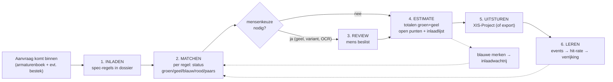

### 4.2 Spec-invoer — welke route neemt een bron?

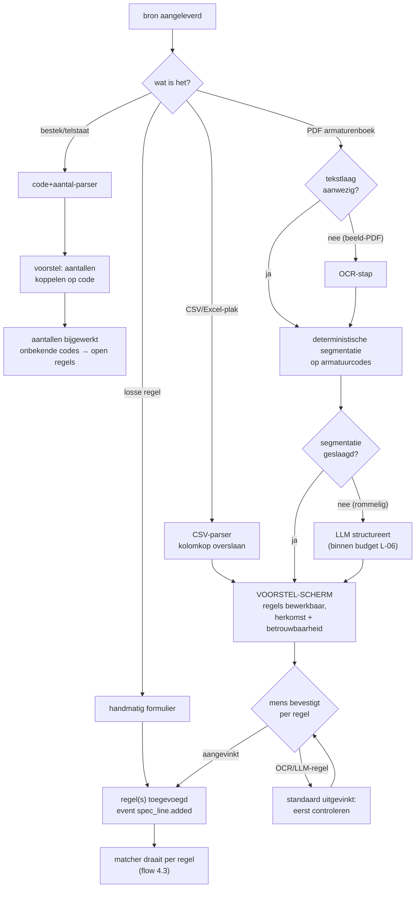

### 4.3 De matcher — vijfstatussen-beslisboom per regel (de regelset als flow)

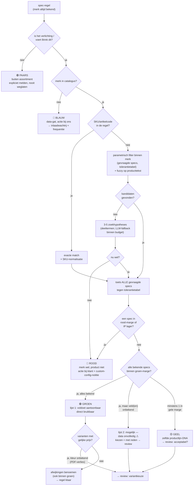

Invarianten die deze flow bewaakt (elk een test): strengste afwijking telt
(rood > geel > groen) · IP lager = altijd rood · kelvin exact · ontbrekend ≠ afwijkend
· elke afwijking benoemd · LLM komt nooit voorbij de kandidaten-stap.

### 4.4 Review-station — wat komt er in de wachtrij en wat mag de mens?

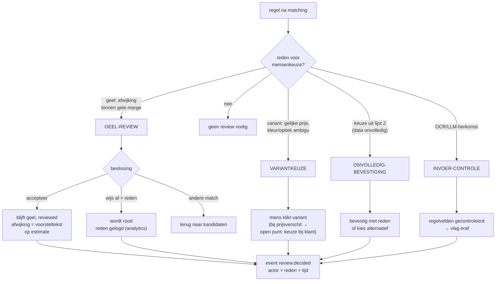

### 4.5 XIS-push — sequence (run 6)

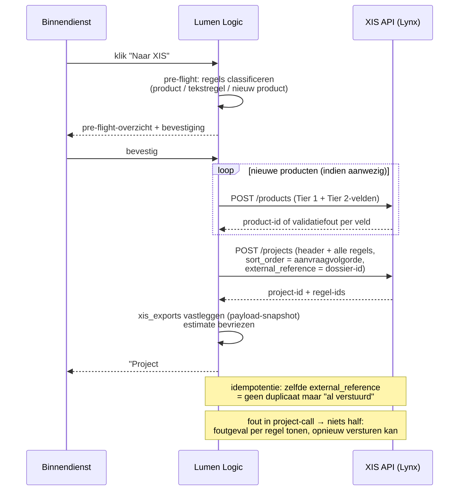

### 4.6 Verrijkingspijplijn (per merk-run)

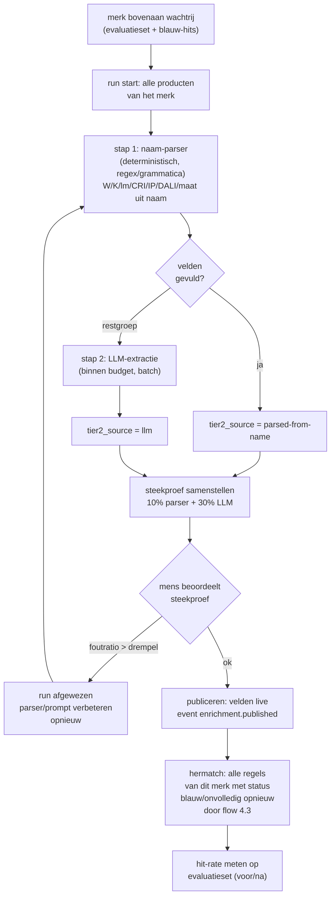

### 4.7 Blauw merk inladen → automatische hermatch

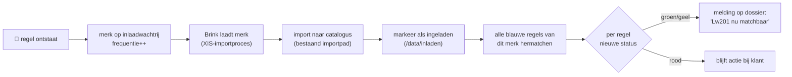

### 4.8 Dossier-statemachine

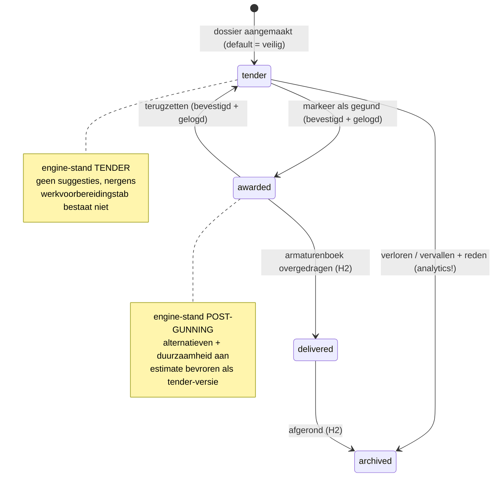

### 4.9 Spec-regel-statemachine

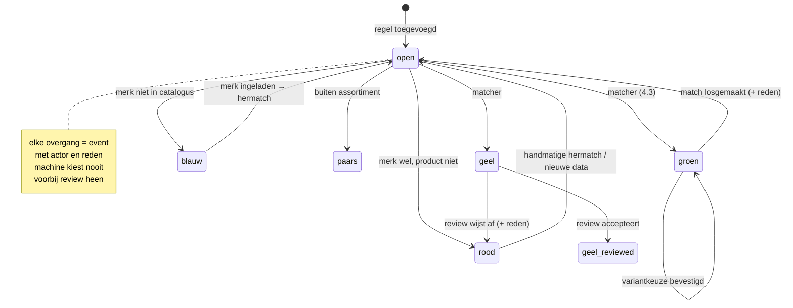

### 4.10 Data-rot & dagprijs (de prijslijst-levenscyclus)

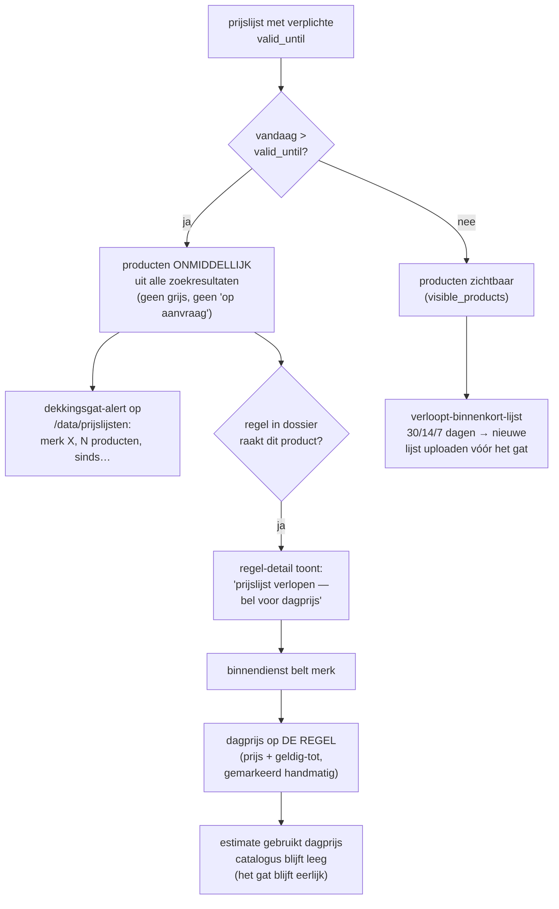

### 4.11 Disclosure-gating per tier (H2 — beslisboom van de product-UI)

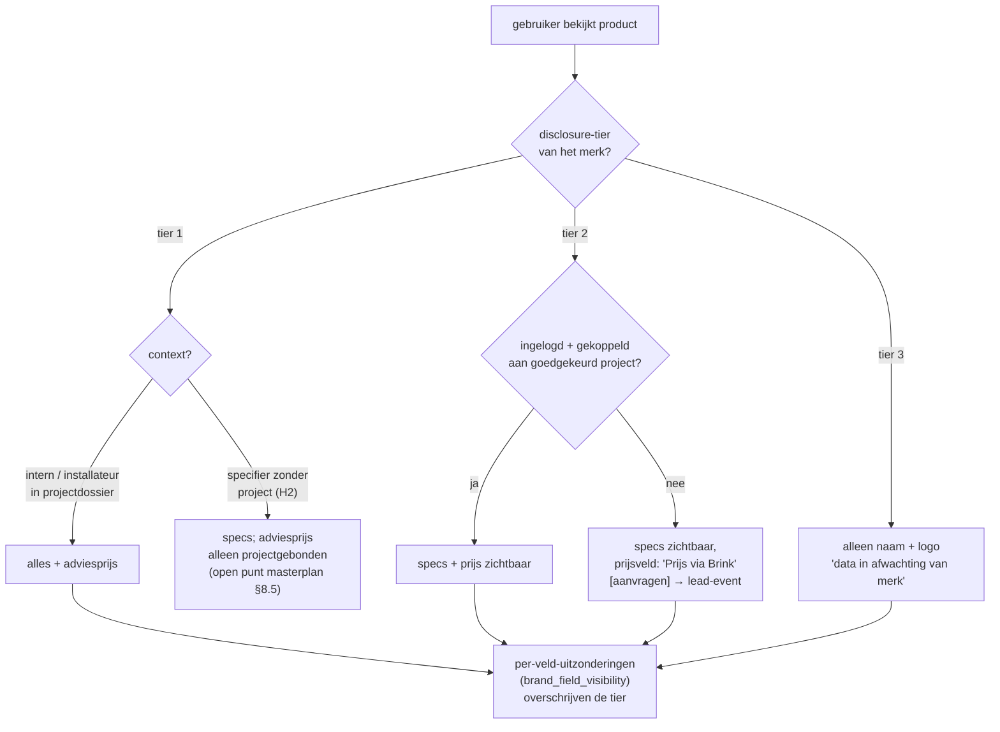

### 4.12 Waar events ontstaan en waar ze heen gaan (K-01 → K-05)

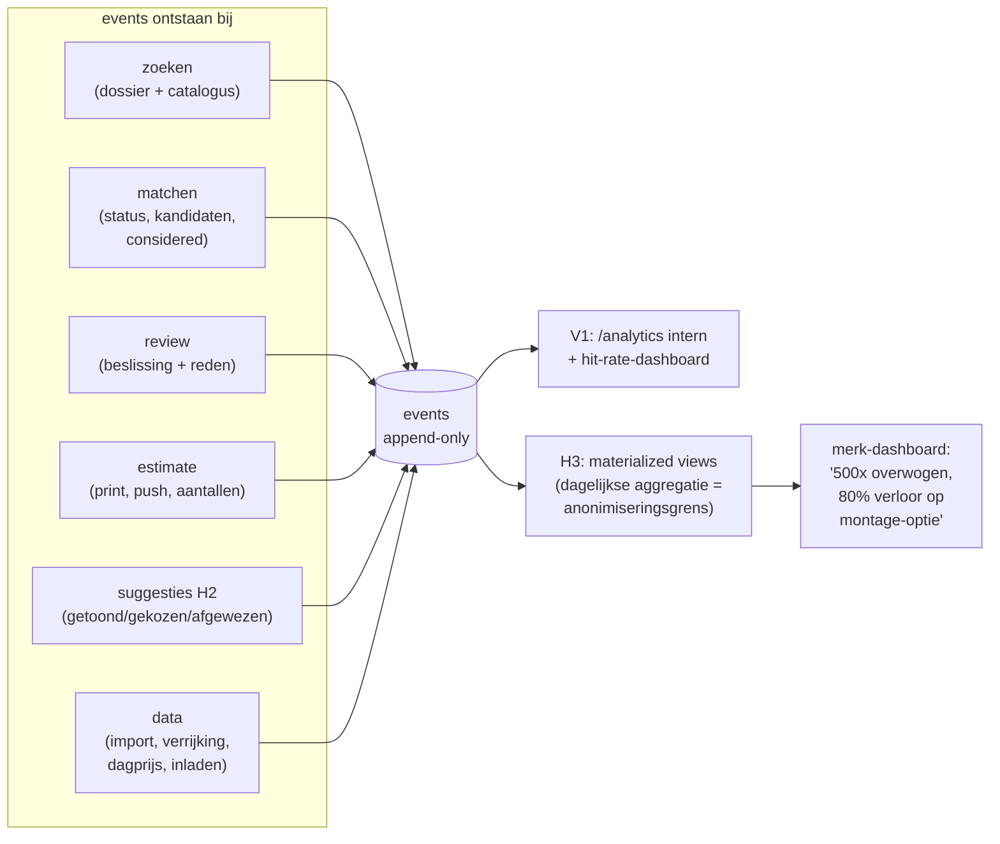

---

## 5. Event-catalogus

Elke rij = een event-`action` in de `events`-tabel. Payload-velden zijn verplicht
tenzij `?`. Consumer: wie het later nodig heeft (K = analytics-cluster).

| action | trigger | payload | consumer |
|---|---|---|---|
| `auth.link_sent` | login-formulier | email | beveiliging/audit |
| `dossier.created` | nieuw dossier | dossierId, name, customer | K-04 |
| `dossier.phase_changed` | faseknop | dossierId, from, to, actor | K-04, F-01-audit |
| `dossier.archived` | archiveren (H2) | dossierId, reason | K-05 (verloren tenders!) |
| `import.started/completed/cancelled` | PDF/CSV/bestek-run | runId, source, counts, confidence | H-07, B-07 |
| `spec_line.added` | regel toegevoegd | lineId, source (manual/csv/pdf/ocr/llm), fields | K-04 |
| `spec_line.quantity_linked` | bestek-koppeling | lineId, qty, source | audit |
| `search.performed` | elke zoekactie | criteria (merk, specs, tekst), resultCount, durationMs | K-04, H-06, dekkingssignaal |
| `product.considered` | kandidaat getoond in lijst 1/2 | lineId, productId, rank, list (1/2) | **K-02 — het "overwogen"-goud** |
| `spec_line.matched` | keuze kandidaat | lineId, productId, status, deviations[], candidateRank | K-02, C-10 |
| `spec_line.no_match` | rood/paars/blauw gezet | lineId, status, reason?, brandText | K-03, H-08 |
| `match.unlinked` | match losgemaakt | lineId, productId, reason | K-03 |
| `review.decided` | elke review-beslissing | lineId, kind (geel/variant/onvolledig/ocr), decision, reason?, actor | D-06, K-03 |
| `brand.load_requested` | blauw-knop | brandText, dossierId | H-08-wachtrij |
| `brand.loaded` | inladen afgerond | brandId, productCount | H-08, hermatch-trigger |
| `estimate.quantity_changed` | aantal gewijzigd op estimate | lineId, from, to | audit |
| `estimate.printed` | print/PDF | dossierId, quoteNumber, totals per kleur | K-04 |
| `estimate.pushed` | XIS-push / export | dossierId, xisProjectId?, lineCount, mode (api/file) | E-12 |
| `price.day_price_set` | dagprijs ingevoerd | lineId, price, validUntil, actor | I-04, I-03-rapport |
| `pricelist.expired` | dagelijkse check | brandId, productCount | I-03-alert |
| `enrichment.run_started/published/rejected` | verrijkingsrun | runId, brandId, counts per bron, sampleErrorRate | H-05/06/07 |
| `evaluation.measured` | hit-rate-meting | setVersion, hitRate, perStatusDiff | K-06 |
| `suggestion.shown/selected/dismissed` | werkvoorbereiding (H2) | lineId, productId, alternativeId, reason? | F-09, K-05 |
| `lead.price_requested` | tier-2-prijsknop (H2) | productId, userId, projectId? | J-03-opvolging |

**Regels:** de repo-functie die de actie uitvoert logt zelf (nooit de UI) · payloads
zijn typed helpers in `lib/repo/events.ts` (geen losse strings) · events worden nooit
gemuteerd of verwijderd.

---

## 6. Rollen & rechten

**V1 (allowlist, geen rollen):** alle 2–5 gebruikers zien en mogen alles; élke
schrijfactie draagt de actor. De tabel hieronder is het H2-eindbeeld (L-03/04) —
rollen zijn petten (meerdere per persoon), rol bepaalt de default-view, **fase bepaalt
wat de engine toont** (nooit de rol).

| Scherm / actie | Calculator | Werkvoorb. | Projectleider | Org-admin | Brink-intern (V1) |
|---|---|---|---|---|---|
| Dossiers zien (eigen org) | ✓ | ✓ | ✓ | ✓ | ✓ (alles) |
| Regels invoeren/matchen | ✓ | ✓ | – | – | ✓ |
| Review beslissen | ✓ | ✓ | – | – | ✓ |
| Faseovergang | ✓ | ✓ | – | – | ✓ |
| Estimate uitsturen | ✓ | – | – | – | ✓ |
| Werkvoorbereiding (gegund) | ✓ (lezen) | ✓ | ✓ (lezen) | – | ✓ |
| Substitutievoorstel maken | – | ✓ | – | – | ✓ |
| Armaturenboek exporteren | – | ✓ | ✓ | – | ✓ |
| Data-werkbank (/data) | – | – | – | – | ✓ |
| Analytics | – | – | – | eigen org | ✓ |
| Instellingen/leden | – | – | – | ✓ | ✓ |
| Default-landing | Regels-tab | Werkvoorbereiding | Armaturenboek | Instellingen | Dossiers |

---

## 7. Niet-functionele eisen

1. **Performance**: estimate met 100 regels rendert en herberekent zonder merkbare
   hapering [E]; zoeken p95 < 300 ms op de huidige 211k (meetpunt voor de
   ES-triggerbeslissing, H-12).
2. **LLM-kosten**: alle LLM-plekken samen onder een instelbare maandcap (`BUDGET_EUR`),
   verbruiksteller zichtbaar in /instellingen; cap bereikt → deterministische route
   met melding, nooit stil doorbetalen [E, L-06].
3. **Idempotentie**: import herdraaibaar (bestaand), XIS-push idempotent op dossier-id,
   verrijkingsruns herstartbaar zonder dubbele publicatie.
4. **Print**: estimate, armaturenboek (en H2: substitutievoorstel) perfect op A4
   zwart-wit; kleuren ook als woord; voettekst met nummer/datum/pagina.
5. **Testregime**: elke feature een white-box RSC-test + screenshots (licht/donker ×
   mobiel/desktop); de regelset-invarianten (§4.3) en de vijf ijzeren regels als
   blijvende regressietests; hit-rate-meting bij elke matcher-wijziging (H-07).
6. **Audit**: geen schrijfactie zonder actor; geen statuswijziging zonder event;
   review-beslissingen reproduceerbaar uit de event-log.
7. **Veiligheid XIS**: sleutel alleen server-side; sandbox-modus default aan tot
   productie expliciet wordt aangezet (Alpárs waarschuwing, mail 24-06).

---

## 8. Open UX-punten

1. **Naamgeving "Estimate" vs "Offerte"** in de UI — regelset zegt offerte, de
   binnendienst zegt estimate; route heet nu `/offerte`. Voorstel: label "Estimate",
   route laten staan. → beslissen bij run-4-bouw.
2. **Foto's/swatches in de variantkeuze** (3.7): brondata heeft geen productfoto's.
   Zonder foto is "kleur kiezen" tekst-only. Opties: kleurnaam-swatch (CSS),
   later merk-beelddata (H3). → run 4: tekst + CSS-swatch.
3. **Zone-invoer bij PDF-import**: zones staan zelden in het armaturenboek; V1 =
   handmatig veld [E]. Auto-extractie uit tekening = H2 (G-03).
4. **Open-punten-lijst bewerkbaar?** Automatisch samengesteld (3.8-7); mag de
   binnendienst punten toevoegen/afvinken? Voorstel: ja, vrije punten + auto-punten,
   afvinken gelogd. → run 4-detail.
5. **Catalogus-zoek zonder merk**: "merk hebben we altijd" geldt voor dossiers; geldt
   het ook voor losse catalogus-verkenning? V1: merk verplicht in /catalogus (zelfde
   aanname), vrij zoeken zonder merk = H2-evaluatie.
6. **Hoeveel kandidaten tonen?** Voorstel: lijst 1 volledig (meestal < 10), lijst 2
   afgekapt op 15 met "toon meer". → tunen op de evaluatieset.
7. **Notificaties**: als een blauw merk is ingeladen en regels hermatchen (4.7), hoe
   hoort de binnendienst dat? V1: banner op het dossier + telling verandert. Mail/
   digest = later.

---

*Einde functioneel ontwerp. Wijzigingen: eerst het masterplan-besluit aanpassen, dan
dit document — nooit andersom.*
